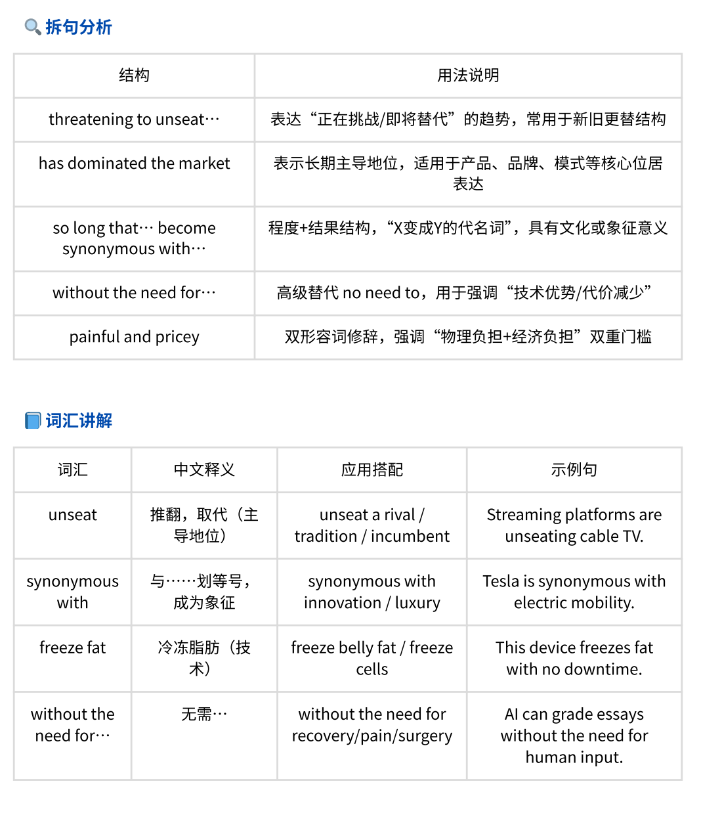
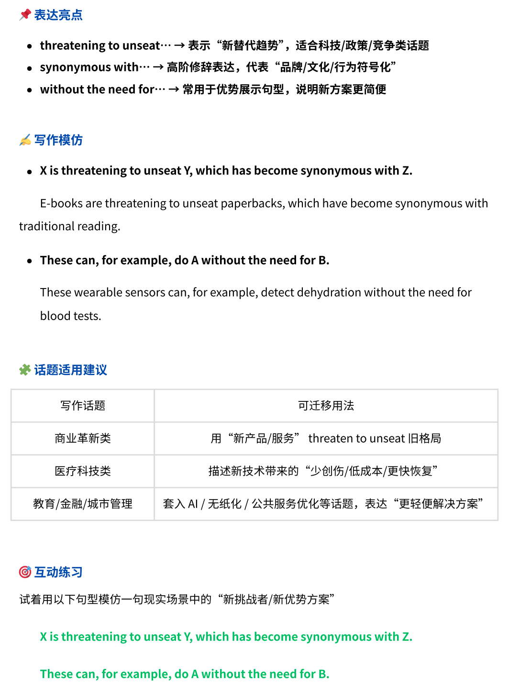
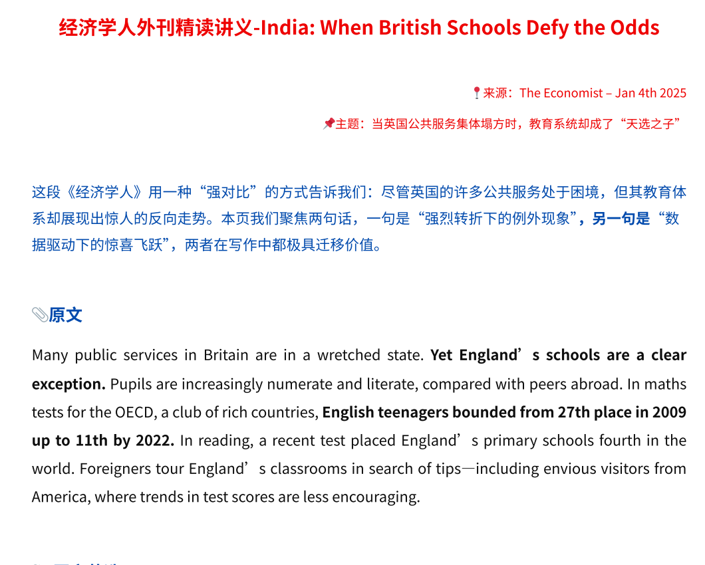
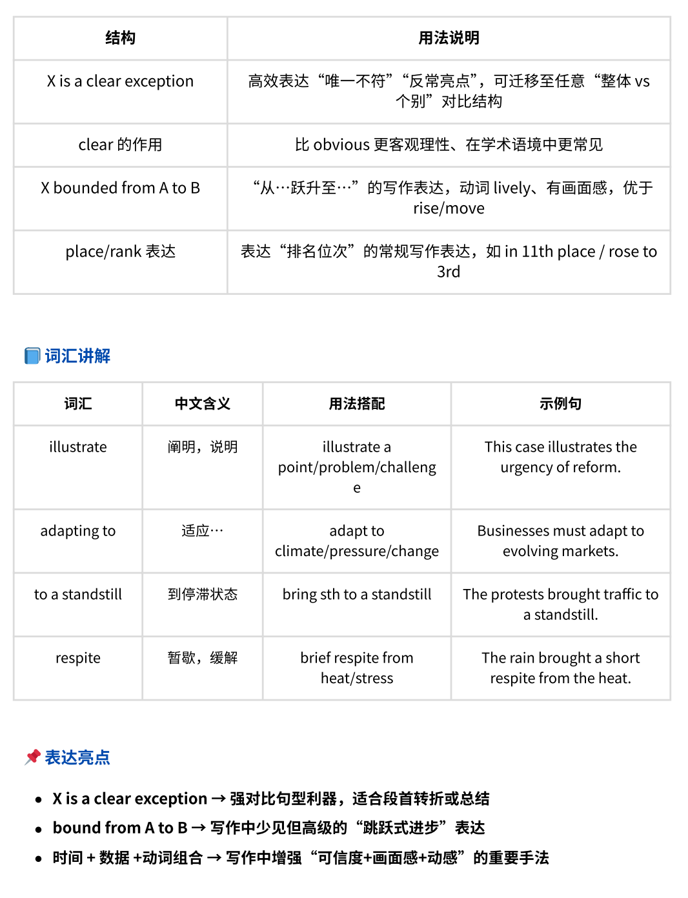

- # Economist-reading-guide
High-level English reading pack with sentence analysis, grammar tips, and writing patterns from The Economist.

📘 专为考研/雅思/写作提升打造的外刊精读套件（拆句+翻译+写作迁移）
# 🧠 Economist Reading Guide | 外刊精读资料

Welcome! This is a curated pack of *The Economist* reading materials designed for English learners who want to:
- Improve academic reading skills
- Master complex sentence structures
- Learn advanced grammar & writing patterns

---

## 📚 What's Inside

| 单元   | 原文主题                                                                                   | 技能亮点说明                                      |
|--------|--------------------------------------------------------------------------------------------|---------------------------------------------------|
| Unit 1 | *How to improve clinical trials*                                                           | 医疗伦理议题 + “两难抉择”句式 + 高阶让步结构       |
| Unit 2 | *Amusing amphibians*                                                                       | 隐喻 + 抽象概念表达 + alienation/transformation   |
| Unit 3 | *Closing the open-door policy*                                                              | 政策对比 + 多义动词搭配 + 高级名词化结构          |
| Unit 4 | *Fair Concerns, Risky Reforms*                                                              | 双重句义 + 并列结构 + 判断类句型                  |
| Unit 5 | *From Terrorism to Great-Power Rivalry*                                                    | 政治转向类叙述 + 逻辑连接副词 + 概括句结构         |
| Unit 6 | *How Storms Drive Migration Northward*                                                     | 因果推理 + 数据表达句式 + 动词+副词组合            |
| Unit 7 | *How to Discredit Pseudoscience with Humor and Logic*                                      | 学术讽刺 + 并列结构 + 引用过渡句                  |
| Unit 8 | *India: Climate Change in Its Most Visible Form*                                           | 描述类表达 + 强调句式 + 地区类议题结构             |
| Unit 9 | *Not Enough Shade: Heat Plans Fall Short Without Structural Change*                        | 比较与让步 + 指代抽象名词 + 强转折表达             |
| Unit10 | *Philosophical Foundations of Democracy*                                                   | 哲学类抽象词汇 + 并列/对称句式 + 高阶修饰语        |
| Unit11 | *A Region Between Powers: Latin America’s Silent Vulnerability*                            | 地缘政治 + 被动态表达 + 分析类句式                 |
| Unit12 | *So Common It’s Strange: When Everyone Gets Plastic Surgery*                               | 反常事实句 + 审美趋势表达 + 修饰后置               |
| Unit13 | *The Amalgamated Face: Beauty in the Age of Global Aesthetics*                             | 审美哲学 + 主语复杂化结构 + 科技描述类搭配         |
| Unit14 | *The Cost of Cheap Water in India*                                                         | 代价类主题句式 + 副词短语移位 + 政策类结构         |
| Unit15 | *The Overlooked Power of Nordic Business*                                                  | 企业成因分析 + 结构类对比 + 强转折                 |
| Unit16 | *Unseating Botox: The New Face of Aesthetic Tech*                                          | 技术审美类表达 + 词组替换 + 并列结构               |
| Unit17 | *When British Schools Defy the Odds*                                                       | 教育类议题 + 概率型句式 + 积极情绪动词             |
| Unit18 | *Zoom, the Unforgiving Mirror*                                                             | 技术与心理隐喻 + 比喻性修饰语 + 评论句结构         |

📌 更多讲义将陆续更新，欢迎关注 pinned 项目获取样张与展示页。

---

## ✨ Preview Sample

🧾 以下为 Unit 16 & Unit 17 精读讲义节选（展示部分结构分析 + 翻译）：

📌 样张图1：拆句分析 + 词汇讲解 

📌 样张图2：表达亮点 + 写作模仿句式  

📌 样张图3：原文 + 写作表达句源分析  

📌 样张图4：核心结构用法说明 + 高分表达解析  

> 🔒 所展示内容为节选样张，完整版包含完整翻译 + 拆句 + 写作训练，请私信获取。
---

## 🛒 获取完整版讲义包（包含翻译 + 拆句 + 写作训练）

📦 内容包含：
- 精读原文 + 中文翻译 + 拆句分析
- 写作模仿 + 高分表达 + 话题迁移句
- 适用于考研写作 / 雅思 Task 2 / 留学申请文书

📲 获取方式：
- 私信小红书主页 👉 `ID: 4230202425`
- 添加微信 👉 `15525140485`
- 🔒 所展示内容为节选样张，完整版为付费资料，严禁复制传播。
---

## 📌 关于我
🧑‍🏫 我正在发布系列英语精读讲义，帮助学生提升写作表达力  
📬 有意购买讲义包、邀请合作教学、或进行定制，请联系我

👋 I'm Charles, a TEFL-certified English teacher with 4+ years of experience.  
I specialize in academic English, IELTS speaking, and deep reading training.

📫 Contact: 737039070zb@gmail.com
